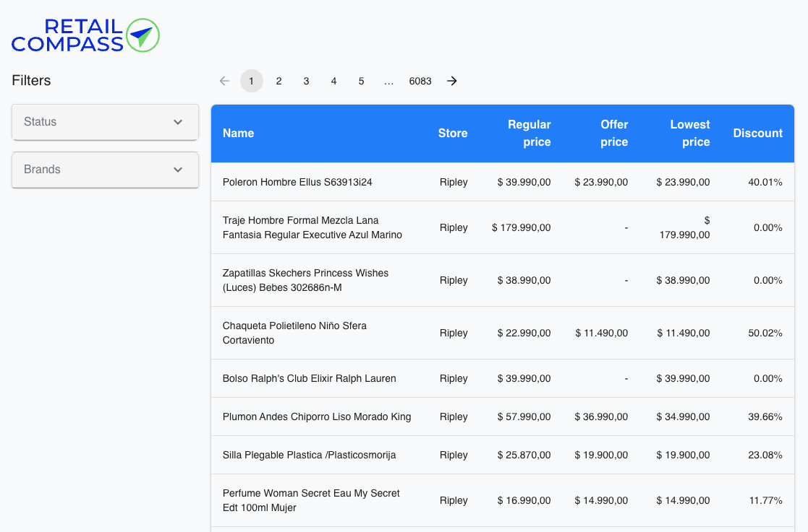

# Retail Compass Chanllege

Bienvenidos a mi solución al reto de Retail Compass.

Pueden encontrarlo en el siguiente link: [Products](https://products-steel-xi.vercel.app/)



## Ejecución en local

Dentro de la carpeta del proyecto crea una archivo: `.env.development` y agregar:

```
VITE_API_KEY=your_api_key
```

Luego ejecutar los siguientes comandos:

```bash
npm install
```
```bash
npm run dev
```
Acceder a la URL ofrecida en la consola: http://localhost:5173/

Para correr las pruebas unitarias:

```bash
npm run test
```

## Características principales


- Construido con React + Typescript
- Diseño responsivo con Grid de Material UI.
- Filtros de productos por Marca y Status.
- Paginación de productos.
- Pruebas unitarias con Jest y React Testing Library.
- Integración de ESLint y Prettier para el formateo de código.
- CI/CD pipeline con GitHub Actions que ejecuta pruebas unitarias, lint y deploy en Vercel.
